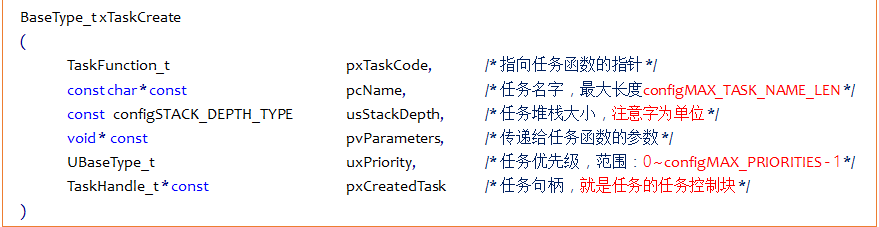

# FreeRTOS任务创建和删除

------

## 一、任务创建和删除API函数(熟悉)

### 1、任务创建和删除的本质

答：任务创建和删除的本质就是调用FreeRTOS的API函数。

### 2、任务动态创建和静态创建的区别

答：

- **动态创建任务** ：任务的任务控制块以及任务的栈空间所需的内存，均由FreeRTOS从FreeRTOS管理的堆中分配。
- **静态创建任务** ：任务的任务控制块以及任务的栈空间所需的内存，需要用户分配提供。

### 3、任务控制块结构体成员介绍

答：

总结：

1. 任务栈栈顶，在任务切换时的任务上下文保存、任务恢复息息相关。
2. 每个任务都有属于自己的任务控制块，类似身份证。

### 4、什么是临界区保护

答：临界区保护，保护那些不想被打断的程序段，关闭freertos所管理的中断，中断无法打断，滴答中断和PendSV中断无法进行不能实现任务调度 。

### 5、动态创建优点

答：动态创建使用起来相对简单。在实际的应用中，动态方式创建任务是比较常用的，除非有特殊的需求，一般都会使用动态方式创建任务 。

### 6、静态创建优点

答：静态创建可将任务堆栈放置在特定的内存位置，并且无需关心对内存分配失败的处理 。

### 7、创建任务时任务堆栈所存内容

答：

1. 寄存器下PSR被初始为0x01000000，其中bit24被置1，表示使用Thumb指令。
2. 寄存器PC被初始化为任务函数指针(任务A，即我们写的任务函数的地址)，这样当某次任务切换后，任务A获得CPU控制权，任务函数(任务A)被出栈到PC寄存器，之后会执行任务A的代码。
3. LR寄存器初始化为函数指针prvTaskExitError，这个函数是FreeRTOS提供的，是一个出错处理函数。
4. 子函数的调用通过寄存器R0~R3传递参数，创建任务时，我们传入的参数被保存到R0中，用来向任务传递参数。

------

## 二、任务创建---动态方法(掌握)

### 1、动态任务创建函数

答：

函数参数：

函数返回值：

### 2、实现静态创建任务流程

答：用起来只需三步。

1. 将FreeRTOSConfig.h文件中宏configSUPPORT_DYNAMIC_ALLOCATION配置为1。
2. 定义函数入口参数。
3. 编写任务函数。

动态任务创建函数创建的任务会立刻进入就绪态，由任务调度器调度运行。

### 3、动态任务创建函数内部实现简述

答：

1. 申请堆栈内存&任务控制块内存。
2. TCB结构体(任务控制块)成员赋值。
3. 添加新任务到就绪列表中。

------

## 三、任务创建---静态方法(掌握)

### 1、静态任务创建函数

答：

函数参数：

函数返回值：

### 2、实现静态创建任务流程

答：用起来只需五步。

1. 将FreeRTOSConfig.h文件中宏configSUPPORT_STATIC_ALLOCATION配置为1。
2. 定义空闲任务&定时器任务的任务堆栈以及TCB。
3. 实现两个接口函数(vAppLicationGetldleTaskMemory() 空闲任务接口函数和vApplicationGetTimerTaskMemory()定时器任务接口函数)。
4. 定义函数入口参数。
5. 编写任务函数。

静态任务创建函数创建的任务会立刻进入就绪态，由任务调度器调度运行。

### 3、静态任务创建函数内部实现简述

答：

1. TCB结构体成员赋值。
2. 添加新任务到就绪列表中。

------

## 四、任务删除

### 1、任务删除函数

答：

任务删除函数用于删除已经被创建的任务，被删除的任务将从就绪任务列表、阻塞任务列表、挂起任务列表和事件列表中移除。

注意：

1. 当传入的参数为NULL，则代表删除任务自身(当前正在运行的任务)。
2. 空闲任务会负责释放被删除任务中由系统分配的内存，但是由用户在任务删除前申请的内存空间，必须用户在任务被删除前提前释放，否则将会导致内存泄漏。

### 2、删除任务流程

答：用起来只需两步。

1. 使用删除任务函数，将FreeRTOSConfig.h文件中宏INCLUDE_vTaskDelete配置为1。
2. 入口参数输入需要删除的任务句柄(NULL代表删除本身)。

### 3、删除任务函数内部实现简述

答：

1. 获取所要删除的任务控制块 --- 通过传入的任务句柄，判断所需要删除哪个任务，NULL代表删除自身。

2. 将被删除任务移除所在列表 --- 将该任务所在列表中移除，包括：就绪、阻塞、挂起、事件等列表。

3. 判断所需要删除的任务

    - 删除任务自身，需要先添加到等待删除列表，内存释放将在空闲任务执行。

    - 删除其他任务，释放内存，任务数量。

4. 更新下个任务的阻塞时间 --- 更新下一个任务的阻塞超时时间，以防止被删除的任务就是下一个阻塞超时的任务。

------

