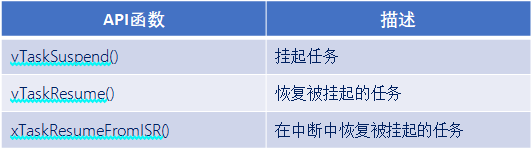

# FreeRTOS的任务挂起与恢复

------

## 一、任务挂起和任务恢复介绍(熟悉)

### 1、任务的挂起与恢复的API函数

答：

- **挂起**：挂起任务类似暂停，可恢复；删除任务，无法恢复，类似“人死两清”。
- **恢复**：恢复被挂起的任务。
- **“FromISR”**：带有FromISR后缀是在中断函数中专用的API函数。

------

## 二、任务挂起(熟悉)

### 1、任务挂起函数介绍

答：

任务挂起函数用于挂起任务，使用时需要将将FreeRTOSConfig.h文件中宏INCLUDE_vTaskSuspend配置为1。

无论优先级如何，被挂起的任务都将不再被执行，直到任务被恢复。

注意：当传入的参数是NULL，则代表挂起任务自身(当前正在运行的任务)。

### 2、任务挂起函数内部实现

答：

1. 获取所要挂起任务的控制块。（根据任务句柄获取任务控制块，如果任务句柄为NULL，表示挂起任务本身。）
2. 移除所在列表。（将要挂起的任务从相应的状态列表和事件列表中移除。）
3. 插入挂起任务列表。（将待挂起任务的任务状态列表项插入到挂起状态列表末尾。）
4. 判断任务调度器是否运行。（判断任务调度器是否运行，在运行，更新下一次阻塞时间，防止被挂起任务为下一个阻塞超时任务。）
5. 判断待挂起任务是否为当前任务。（如果挂起的是任务自身，且调度器正在运行，需要进行一次任务切换；调度器没有运行，判断挂起任务数是否等于任务总数，是：当前控制块赋值为NULL，否：寻找下一个最高优先级任务。）

------

## 三、任务恢复(熟悉)

### 1、任务恢复函数介绍(任务中恢复)

答：

.png)

使用该函数时需要将FreeRTOSConfig.h文件中宏INCLUDE_vTaskSuspend配置为1。

注意：任务无论被vTaskSuspend()挂起多少次，只需在任务中调用vTaskResume()恢复一次就能继续运行，且被恢复的任务会进入就绪态。

### 2、任务恢复函数(任务中恢复)内部实现

答：

1. 恢复任务不能是正在运行任务。
2. 判断任务是否子啊挂起列表中。（是：就会将该任务在挂起列表中移除，将该任务添加到就绪列表中。）
3. 判断恢复任务优先级。（判断恢复的任务优先级是否大于当前正在运行的任务，是的话，执行任务切换。）

### 3、任务恢复函数介绍(中断中恢复)

答：

.png)

使用该函数注意要将FreeRTOSConfig.h文件中宏INCLUDE_vTaskSuspend和INCLUDE_xTaskResumeFromISR配置为1。

该函数专用于中断服务函数中，用于解挂被挂起任务。

注意：中断服务程序中要调用freeRTOS的API函数则中断优先级不能高于FreeRTOS所管理的最高优先级。

### 4、任务恢复函数(中断中恢复)内部实现

答：

1. 关闭freertos可管理中断，防止被其他的中断打断，并返回关闭前basepri寄存器的值。
2. 判断是否有挂起任务。
3. 将前面保存的basepri的值，恢复回来。
4. 返回xYieldRequired的值 用于决定是否需要进行任务切换。

------

