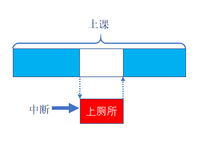
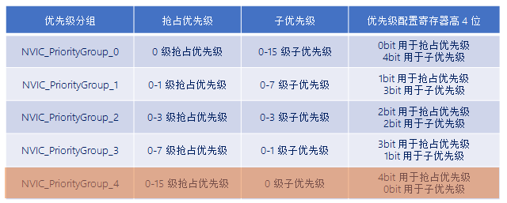

# FreeRTOS中断管理简介

------

## 一、中断介绍(了解)

### 1、什么是中断

答：让CPU打断正常运行的程序，转而去处理紧急的事件(程序)，就叫中断。

### 2、中断执行机制

答：可简单概括为三步：

1. **中断请求** ：外设产生中断请求(如：GPIO外部中断、定时器中断...)。
2. **响应中断** ：CPU停止执行当前程序，转而执行中断处理程序(ISR)。
3. **退出中断** ：执行完毕，返回被打断的程序处，继续往下执行。

------

## 二、中断优先级分组设置(熟悉)

### 1、中断优先级分组介绍

答：ARM Cortex-M 使用了8位宽的寄存器来配置中断的优先等级，这个寄存器就是中断优先级配置寄存器。但STM32只用了中断优先级配置寄存器的高4位[7:4]，所以STM32提供了最大16级(0~15)的中断优先等级。

### 2、什么是抢占优先级，什么是子优先级

答：STM32的中断优先级可以分为抢占优先级和子优先级。

- **抢占优先级** ：抢占优先级的中断可以打断正在执行但抢占优先级低的中断。
- **子优先级** ：当同时发生具有相同抢占优先级的两个中断时，子优先级数小的优先执行。

注意 ：中断优先级(抢占优先级和子优先级)数值越小，优先级越高。

### 3、中断优先级配置方式

答：一共有5种配置方式，对应着中断优先级分组的5个组。

注意：FreeRTOS中为了方便管理，采用第4号(NVIC_PriorityGroup_4)分配方式。

### 4、FreeRTOS中对中断优先级的管理

答： 

1. 低于configMAX_SYSCALL_INTERRUPT_PRIORITY优先级的中断才允许调用FreeRTOS的API函数。
2. 建议将所有优先级位指定为抢占优先级位，方便FreeRTOS管理。
3. 中断优先级数值越小越优先，任务优先级数值越大越优先。

------

## 三、中断相关寄存器(熟悉)

### 1、系统中断优先级配置寄存器

答：三个系统中断优先级配置寄存器，分别为 SHPR1、 SHPR2、 SHPR3 。

- SHPR1寄存器地址：0xE000ED18~0xE000ED1B
- SHPR2寄存器地址：0xE000ED1C~0xE000ED1F
- SHPR3寄存器地址：0xE000ED20~0xE000ED23

注意：FreeRTOS主要是使用SHPR3寄存器对**PendSV**和**Systick**中断优先级进行设置(设置为最低优先级)。

### 2、FreeRTOS如何配置PendSV和Systick中断优先级

答：

注意：在FreeRTOS系统中PendSV和SysTick设置最低优先级。

### 3、为什么将PendSV和SysTick设置最低优先级

答：保证系统任务切换不会阻塞系统其他中断的响应。

### 4、中断屏蔽寄存器

答：三个中断屏蔽寄存器，分别为PRIMASK、FAULTMASK和BASEPRI 。

FreeRTOS所使用的中断管理就是利用的**BASEPRI**这个寄存器。

### 5、BASEPRI中断屏蔽寄存器

答：BASEPRI：屏蔽优先级低于某一个阈值的中断，当设置为0时，则不关闭任何中断。

比如： BASEPRI设置为0x50，代表中断优先级在5\~15内的均被屏蔽，0~4的中断优先级正常执行

### 6、FreeRTOS的关中断程序

答：

### 7、FreeRTOS的开中断程序

答：

### 8、中断服务函数调用FreeRTOS的API函数需注意

答：

1. 中断服务函数的优先级需在FreeRTOS所管理的范围内。
2. 在中断服务函数里边需调用FreeRTOS的API函数，必须使用带“FromISR”后缀的函数。

------

