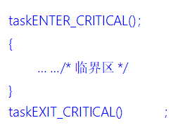

# FreeRTOS临界段代码保护

------

## 一、临界段代码保护简介(熟悉)

### 1、什么是临界段

答：临界段代码也叫临界区，是指那些必须完整运行，不能被打断的代码片段。运行时临界段代码时需要关闭中断，当处理完临界段代码以后再打开中断。

### 2、适用什么场合

答：

- **外设** ：需要严格按照时序初始化的外设，如IIC、SPI等。
- **系统** ：系统自身需求，如任务切换过程等。
- **用户** ：用户需求，如我们写的任务创建任务。

### 3、什么可以打断当前程序的运行

答：中断、任务调度。

------

## 二、临界段代码保护函数介绍(掌握)

### 1、临界段代码保护函数

答：

任务级临界区调用格式示例：

中断级临界区调用格式示例：

### 2、临界段代码保护函数使用特点

答：

1. 成对使用。
2. 支持嵌套。
3. 尽量保持临界段耗时短。

------

