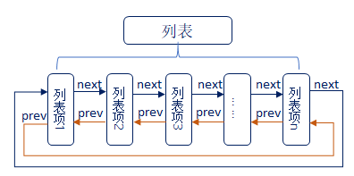
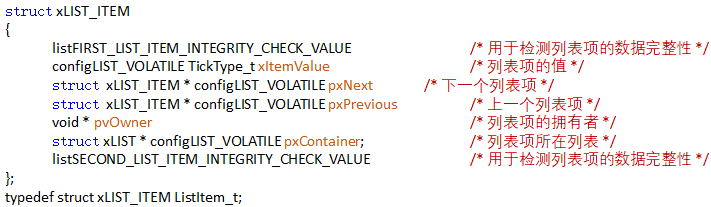
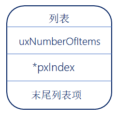
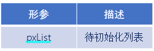
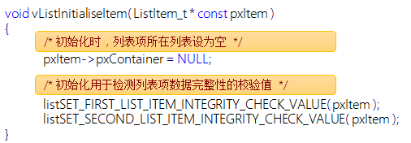

# FreeRTOS的列表和列表项

------

## 一、列表和列表项的简介(熟悉)

### 1、什么是列表

答：列表是FreeRTOS中的一个数据结构，概念上和链表有点类似，列表被用来跟踪FreeRTOS中的任务。

### 2、什么列表项

答：列表项就是存放在列表中的项目。

### 3、列表和列表项关系

答：列表相当于链表，列表项相当于节点，FreeRTOS中的列表是一个双向环形链表。

### 4、列表(链表)和数组的区别

答：

- **列表的特点**：列表项间的地址非连续的，是人为的连接到一起的。列表项的数目是由后期添加或删除的个数决定的，随时可以改变。
- **数组的特点**：数组成员地址是连续的，数组在最初确定了成员数量后，后期将无法改变。

### 5、OS中为什么使用列表

答：在OS中任务的数量是不确定的，并且任务状态是会发生改变的，所以非常适用列表(链表)这种数据结构。

### 6、列表结构体介绍

答：有关列表的东西均在文件list.c和list.h中，以下是列表结构体：

1. 在结构体中，包含两个宏(listFIRST_LIST_INTEGRITY_CHECK_VALUE 和  listSECOND_LIST_INTEGRITY_CHECK_VALUE)，这两个宏是确定的已知常量，FreeRTOS通过检查这两个常量的值，来判断列表的数据在程序运行过程中，是否遭到破坏，该功能一般用于测试，默认是不开启的(我们一般不用去理会)。
2. 成员uxNumberOfltems，用于记录列表中的列表项的个数(不包括xListEnd)。
3. 成员pxIndex用于指向列表中的某个列表项，一般用于遍历列表中的所有列表项。
4. 成员变量xListEnd是一个迷你列表项，排在最末尾。

列表结构示意图：

### 7、列表项结构体介绍

答：列表项是列表中用于存放数据的地方，在list.h文件中，列表项的相关结构体定义：

1. 成员变量xItemValue为列表项的值，这个值多用于按升序对列表中的列表项进行排序。
2. 成员变量pxNext和pxPrevious分别用于指向列表中列表项的下一个列表项和上一个列表项。
3. 成员变量pxOwner用于指向包含列表项的对象(通常是任务控制块)。
4. 成员变量pxContainer用于执行列表项所在列表。

列表项结构体示意图：

### 8、迷你列表项

答：迷你列表项也是列表项，但迷你列表项仅用于标记列表的末尾和挂载其他插入列表中的列表项。

1. 成员变量xItemValue为列表项的值，这个值多用于按升序对列表中的列表项进行排序。
2. 成员变量pxNext和pxPrevious分别用于指向列表中列表项的下一个列表项和上一个列表项。
3. 迷你列表项只用于标记列表的末尾和挂载其他插入列表中的列表项，因此不需要成员变量pxOwner和pxContainer，以节省内存开销。

迷你列表项示意图：

### 9、列表和列表项关系事例

答：

列表初始状态：

列表插入两个列表项：

列表当前状态：

------

## 二、列表相关的API函数介绍(掌握)

### 1、列表API函数

答：

### 2、初始化列表函数vListInitialise()

答：

函数参数：

列表初始化后示意图：

### 3、初始化列表项函数vListInitialiseItem()

答：

函数参数：

列表初始化后示意图：

### 4、列表插入列表项函数vListInsert()

答：此函数用于将待插入列表的列表项按照列表项值升序进行排序，有序地插入到列表中 。

函数参数：

总结：函数vListInsert()，是将插入列表的列表项按照列表项值升序进行排列，有序地插入到列表中。

### 5、列表末尾插入列表项vListInsertEnd()

答：此函数用于将待插入列表的列表项插入到列表 pxIndex 指针指向的列表项前面，是一种无序的插入方法。

函数参数：

### 6、列表项移除函数uxListRemove()

答：此函数用于将列表项从列表项所在列表中移除。

函数参数：

函数返回值：

------

