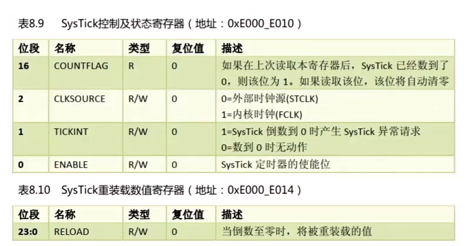

# FreeRTOS任务调度

------

## 一、开启任务调度器(熟悉)

### 1、开启任务调度器函数vTaskStartScheduler()

答：作用：启动任务调度器，任务调度器启动后，FreeRTOS便会开始进行任务调度。

该函数内部实现，如下：

1. 创建空闲任务。
2. 如果使能软件定时器，则创建定时器任务。
3. 关闭中断，防止调度器开启之前或过程中，受到中断干扰，会在运行第一个任务时打开中断。
4. 初始化全局变量，并将任务调度器的运行标志设置为已运行。
5. 初始化任务运行时间统计功能的时基定时器。
6. 调用函数xPortStartScheduler()。

### 2、配置硬件架构及启动第一个任务函数xPortStartScheduler()

答：作用：该函数用于完成启动任务调度器中与硬件架构相关配置部分，以及启动第一个任务。

该函数内部实现，如下：

1. 检测用户在FreeRTOSConfig.h文件中对中断的配置是否有误。
2. 配置PendSV和SysTick的中断优先为最低优先级。
3. 调用函数vPortSetupTimerInterrupt()配置SysTick。
4. 初始化临界区嵌套计数器为0。
5. 调用函数prvEnableVFP()使能FPU。
6. 调用函数prvStartFirstTask()启动第一个任务。

### 3、SysTick滴答定时器

答：

### 4、堆和栈的地址生长方向

答：

**堆**  的生长方向向上，内存地址由低到高；

**栈**  的生长方向向下，内存地址由高到低。

### 5、压栈和出栈的地址增长方向

答：堆栈的生长方向从最本质的理解是堆栈入栈方向是从高地址向地址还是低地址向高地址。

从高地址向低地址生长一般叫做向下生长，也叫作逆向生长。

从低地址向高地址生长一般叫做向上生长，也叫作正向生长。

一般来说堆栈是逆向生长的。

- 51单片机的堆栈生长方向为正向生长，因为执行PUSH指令时先将SP的值加1再将指定的8位数据单元的内容入栈。

- 80x86微机的堆栈生长方向为逆向生长，因为执行PUSH指令时先将SP的值减2再将指定的16位数据单元内容入栈。高字节放高地址，低字节放低地址（小端模式）。

- STM32的堆栈生长方向是逆向生长。

注意：C语言中传递参数，一般是从右向左入栈的，所以最左边的参数是最先出栈的。

### 5、知识补充

1s =  1000ms

1ms = 1000us

1us = 1000ns

1Mhz = 1000 000hz

hz转换为s公式：1s =  1/(1hz)

例如：10hz等于0.1s (0.1s = 1 / 10hz)。

------

## 二、启动第一个任务(熟悉)

### 1、启动第一个任务涉及的关键函数

答：

prvStartFirstTask()      /* 启动第一个任务 */

vPortSVCHandle()     /* SVC中断服务函数 */

### 2、想象一下应该如何启动第一个任务 

答：假设我们要启动的第一个任务是任务A，那么就需要将任务A的寄存器值恢复到CPU寄存器中。任务A的寄存器值，在一开始创建任务时就已经保存在任务堆栈里边了！

注意：

1. 中断产生时，硬件自动将xPSR、PC(R15)、LR(R14)、R12、R3\~R0保存和恢复，而R4\~R11需要手动保存和恢复。
2. 进入中断后，硬件会强制使用MSP指针，此时LR(R14)的值将会被自动更新为特殊的EXC_RETURN。

### 3、prvStartFirstTask() 介绍

答：用于初始化启动第一个任务前的环境，主要是重新设置MSP指针，并使能全局中断，最后触发SVC中断。

### 4、什么是MSP指针

答：程序在运行过程中需要一定的栈空间来保存局部变量等信息。当有信息保存到栈中时，MCU会自动更新SP指针，ARM Cortex-M内核提供了两个栈空间：

- **主堆栈指针(MSP)**：它是给OS内核、异常服务程序以及所有需要特权访问的应用程序代码来使用的。
- **进程堆栈指针(PSP)**：用于常规的应用程序代码(不处于异常服务程序中时使用)。

在FreeRTOS中，中断使用MSP(主堆栈)，中断以为使用PSP(进程堆栈)。

注意：在RTOS中是使用双堆栈指针(即使用MSP和PSP)，但在裸机中是只使用MSP(主堆栈)。

### 5、为什么汇编代码要PRESERVE8(八字节对齐)

答：因为栈在任何时候都是需要4字节对齐的，而在调用入口得8字节对齐，在C编程的时候，编译器会自动帮我们完成对齐操作，而汇编则需要手动对齐。

### 6、prvStartFirstTask()为什么要操作0XE00ED08

答：因为需要从0XE000ED08获取向量表的偏移，为啥要获取向量表呢？因为向量表的第一个是MSP指针！获取MSP的初始值的思路是先根据向量表的位置寄存器VTOR(0XE000ED08)来获取向量表存储的地址，再根据向量表存储的地址，来访问第一个元素，也就是初始的MSP。

### 7、vPortSVCHandle()介绍

答：当使能了全局中断，并且手动触发SVC中断后，就会进到SVC的中断服务函数中。

1. 通过pxCurrentTCB获取优先级最高的就绪态任务的任务栈地址，优先级最高的就绪态任务是系统将要运行的任务。
2. 通过任务的栈顶指针，将任务栈中的内容出栈到CPU寄存器中，任务栈中的内容在调用任务创建函数的时候，已初始化，然后设置PSP指针。
3. 通过往BASEPRI寄存器中写0，允许中断。
4. R14是链接寄存器LR，在ISR中(此刻我们在SVC的ISR中)，它记录了异常返回值EXC_RETURN，而EXC_RETURN只有6个合法的值(M4、M7)，如下表所示：.png)

注意：

1. SVC中断只在启动第一次任务时会调用一次，以后均不调用。
2. R14(LR链接寄存器)，在异常处理期间(就是中断函数中)，LR存的是特殊的EXC_RETURN(异常返回)数值，该数值会在异常处理结束时触发异常返回；在普通函数中，LR用于函数或者子程序调用时返回地址的保存。

### 8、出栈/压栈汇编指令详解

答：

1. **出栈（恢复现场）**，方向：从下往上（低地址往高地址）：假设r0地址为0x04汇编指令示例：

    ldmia r0!, {r4-r6}  /* 任务栈r0地址由低到高，将r0存储地址里面的内容手动加载到 CPU寄存器r4、r5、r6 */

    r0地址(0x04)内容加载到r4，此时地址r0 = r0+4 = 0x08

    r0地址(0x08)内容加载到r5，此时地址r0 = r0+4 = 0x0C

    r0地址(0x0C)内容加载到r6，此时地址r0 = r0+4 = 0x10

2. **压栈（保存现场）**，方向：从上往下（高地址往低地址）：假设r0地址为0x10汇编指令示例：

    stmdb r0!, {r4-r6} }  /* r0的存储地址由高到低递减，将r4、r5、r6里的内容存储到r0的任务栈里面。 */

    地址：r0 = r0-4 = 0x0C，将r6的内容（寄存器值）存放到r0所指向地址(0x0C)

    地址：r0 = r0-4 = 0x08，将r5的内容（寄存器值）存放到r0所指向地址(0x08)

    地址：r0 = r0-4 = 0x04，将r4的内容（寄存器值）存放到r0所指向地址(0x04)

------

## 三、任务切换(掌握)

### 1、任务切换的本质

答：任务切换的本质就是CPU寄存器内容的切换。

假设当由任务A切换到任务B时，主要分为两步：

**第一步**：需暂停任务A的执行，并且将此时任务A寄存器保存到任务堆栈中，这个过程叫做保存现场；

**第二步**：将任务B的各个寄存器值(被存于任务堆栈中)恢复到CPU寄存器中，这个过程叫做恢复现场。

对任务A保存现场，对任务B恢复现场，这个过程称为：**上下文切换**。

### 2、任务切换过程

答：

注意：任务切换的过程在PendSV中断服务函数里边完成。

### 3、PendSV中断是如何触发的

答：

1. 滴答定时器中断调用
2. 执行FreeRTOS提供的相关API函数：portYIELD()。

本质是通过中断控制和状态寄存器ICSR的bit28写入1挂起PendSV来启动PendSV中的。

上表摘取于《Cortex M3权威指南(中文)》第131页。

### 4、在PendSV中断中PSP和MSP

答：在进入PendSV异常前的自动压栈使用的是进程堆栈(PSP)，正式进入到PendSV异常Handle后才自动改为主堆栈(MSP)，退出异常时切回PSP，并且从进程堆栈(PSP)上弹出数据(出栈)。

注意：在PendSV中断中时，CPU使用的是MSP，但我们要处理的是PSP的数据存取。

### 5、查找最高优先级任务

答：

vTaskSwitchContext( )                                         /* 查找最高优先级任务 */

taskSELECT_HIGHEST_PRIORITY_TASK( )    /* 通过这个函数完成 */

### 6、前导置零指令

答：

所谓的前导置零指令，大家可以简单理解为计算一个 32位数，出现第一个1前头部 0 的个数。

------

