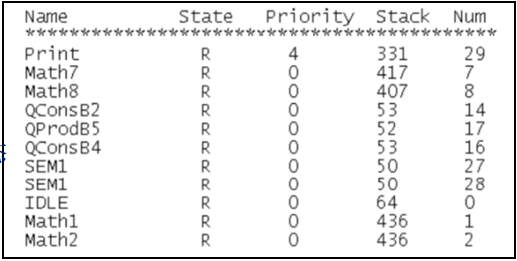
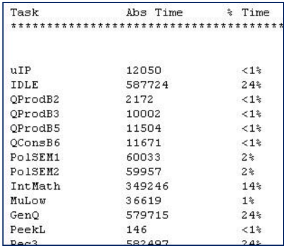

# FreeRTOS任务相关的其他API函数

------


## 一、FreeRTOS任务相关的其他API函数介绍

### 1、FreeRTOS任务相关API函数介绍(部分常用的)

答：


------


## 二、任务状态查询API函数

### 1、获取任务优先级函数

答：

```C
UBaseType_t  uxTaskPriorityGet(  const TaskHandle_t xTask  )
```

此函数用于获取指定任务的任务优先级，使用该函数需要将宏 INCLUDE_uxTaskPriorityGet 置1。

函数参数：


函数返回值：


### 2、修改任务优先级函数

答：

```c
void vTaskPrioritySet( TaskHandle_t xTask , UBaseType_t uxNewPriority )
```

此函数用于改变某个任务的任务优先级，使用该函数需将宏 INCLUDE_vTaskPrioritySet 为 1 。

函数参数：


### 3、获取系统任务数量函数

答：

```c
UBaseType_t   uxTaskGetNumberOfTasks( void )
```

此函数用于获取系统中任务的任务数量。

函数返回值：


### 4、获取系统中所有任务状态信息函数

答：

```C
UBaseType_t   uxTaskGetSystemState(   TaskStatus_t * const pxTaskStatusArray,
                                      const UBaseType_t uxArraySize,
                                      configRUN_TIME_COUNTER_TYPE * const pulTotalRunTime   )
```

此函数用于获取系统中所有任务的任务状态信息，使用该函数需将宏 configUSE_TRACE_FACILITY 置 1。

函数参数：


函数返回值：


参数成员pxTaskStatusArray的结构体：

```C
typedef struct xTASK_STATUS
{
    TaskHandle_t                   xHandle;                     /* 任务句柄 */ 
    const char *                   pcTaskName;                  /* 任务名 */
    UBaseType_t                    xTaskNumber;                 /* 任务编号 */
    eTaskStatee                    CurrentState;                /* 任务状态 */
    UBaseType_t                    uxCurrentPriority;           /* 任务优先级 */
    UBaseType_t                    uxBasePriority;              /* 任务原始优先级*/
    configRUN_TIME_COUNTER_TYPE    ulRunTimeCounter;            /* 任务运行时间*/
    StackType_t *                  pxStackBase;                 /* 任务栈基地址 */
    configSTACK_DEPTH_TYPE         usStackHighWaterMark;        /* 任务栈历史剩余最小值 */
} TaskStatus_t;
```


### 5、获取系统中单个任务状态信息函数

答：

```c
void vTaskGetInfo(  TaskHandle_t     xTask,
                    TaskStatus_t *   pxTaskStatus,
                    BaseType_t       xGetFreeStackSpace,
                    eTaskState       eState  )  
```

此函数用于获取指定的单个任务的状态信息，使用该函数需将宏 configUSE_TRACE_FACILITY 置 1 

函数参数：


参数成员eState的结构体：

```C
typedef enum
{
    eRunning = 0,       /* 运行态 */
    eReady,             /* 就绪态 */
    eBlocked,           /* 阻塞态 */
    eSuspended,         /* 挂起态 */
    eDeleted,           /* 任务被删除 */
    eInvalid            /* 无效 */ 
} eTaskState;
```


### 6、获取当前任务的任务句柄函数

答：

```c
TaskHandle_t    xTaskGetCurrentTaskHandle( void )
```

此函数用于获取当前任务的任务句柄， 使用该函数需将宏 INCLUDE_xTaskGetCurrentTaskHandle 置 1。

函数返回值：


### 7、通过任务名获取任务句柄函数

答：

```c
TaskHandle_t xTaskGetHandle(const char * pcNameToQuery); 
```

此函数用于通过任务名获取任务句柄 ， 使用该函数需将宏 INCLUDE_xTaskGetHandle 置 1。

函数参数：


函数返回值：


### 8、获取指定任务的任务堆栈历史最小剩余函数

```c
UBaseType_t    uxTaskGetStackHighWaterMark( TaskHandle_t  xTask )
```

此函数用于获取指定任务的任务栈历史最小剩余堆栈；使用该函数需将宏 INCLUDE_uxTaskGetStackHighWaterMark 置 1。

函数参数：


函数返回值：


### 9、查询指定任务运行状态函数

答：

```c
eTaskState    eTaskGetState(TaskHandle_t xTask)
```

此函数用于查询某个任务的运行状态，使用此函数需将宏 INCLUDE_eTaskGetState 置1 

函数参数：


函数返回值：


参数成员xTask的结构体：

```c
typedef enum
{
    eRunning = 0,	/* 运行态 */
    eReady,         /* 就绪态 */
    eBlocked,       /* 阻塞态 */
    eSuspended,     /* 挂起态 */
    eDeleted,       /* 任务被删除 */
    eInvalid        /* 无效 */ 
} eTaskState;
```


### 10、以“表格”的形式获取系统中任务信息函数

答：

```c
void   vTaskList(char * pcWriteBuffer)
```

此函数用于以“表格”的形式获取系统中任务的信息 ；

使用此函数需将宏 configUSE_TRACE_FACILITY 和configUSE_STATS_FORMATTING_FUNCTIONS 置1 。

函数参数：


表格内容：



- Name：创建任务的时候给任务分配的名字。
- State：任务的壮态信息， B 是阻塞态， R 是就绪态， S 是挂起态， D 是删除态。
- Priority：任务优先级。
- Stack： 任务堆栈的“高水位线”，就是堆栈历史最小剩余大小。
- Num：任务编号，这个编号是唯一的，当多个任务使用同一个任务名的时候可以通过此编号来做区分。

------


## 三、任务时间统计API函数

### 1、任务时间统计函数

答：

```c
void    vTaskGetRunTimeStats( char * pcWriteBuffer ) 
```

此函数用于统计任务的运行时间信息，使用此函数需将宏 configGENERATE_RUN_TIME_STAT 、configUSE_STATS_FORMATTING_FUNCTIONS 置1。

函数参数：


时间统计表格：



- Task：任务名称。
- Abs Time：任务实际运行的总时间(绝对时间)。
- %Time：占总处理时间的百分比。


### 2、时间统计API函数使用流程

答：

1.将宏 configGENERATE_RUN_TIME_STATS 置1 。

2.将宏 configUSE_STATS_FORMATTING_FUNCTIONS 置1 。

3.当将此宏 configGENERATE_RUN_TIME_STAT 置1之后，还需要实现2个宏定义：

1）portCONFIGURE_TIMER_FOR_RUNTIME_STATE() ：用于初始化用于配置任务运行时间统计的时基定时器；

注意：这个时基定时器的计时精度需高于系统时钟节拍精度的10至100倍！

2）portGET_RUN_TIME_COUNTER_VALUE()：用于获取该功能时基硬件定时器计数的计数值 。

------

