# FreeRTOS消息队列

------


## 一、队列简介

### 1、FreeRTOS中的消息队列是什么

答：消息队列是任务到任务、任务到中断、中断到任务数据交流的一种机制(消息传递)。


### 2、消息队列和全局变量的区别

答：消息队列作用有点类似于全局变量，但消息队列在RTOS中比全局变量更安全可靠。

假设有一个全局变量a=0，现在有两个任务都要写这个变量a。


上图中任务1和任务2在RTOS中相互争取修改a的值，a的值容易受损错乱。

全局变量的弊端：数据无保护，导致数据不安全，当多个任务同时对该变量操作时，数据易受损。


### 3、使用队列的情况

答：使用队列的情况如下：


读写队列做好了保护，防止多任务或中断同时访问产生冲突。我们只需直接调用API函数即可，简单易用。

注意：FreeRTOS基于队列，实现了多种功能，其中包括队列集、互斥信号量、计数信号量、二值信号量、递归互斥信号量，因此很有必要深入了解FreeRTOS的队列。


### 4、队列项目和队列长度

答：在队列中可以存储数量有限、大小固定的数据。队列中的每个数据就叫做 “队列项目” ，队列能够存储 “队列项目” 的最大数量称为队列的长度。

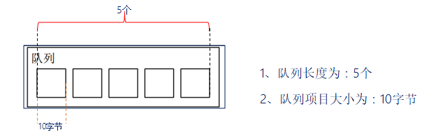

在创建队列时，就要指定队列长度以及队列项目的大小！


### 5、FreeRTOS队列特点

答：

1. **数据入队出队方式** ： 队列通常采用 “先进先出(FIFO)” 的数据存储缓冲机制，即先入队的数据会先从队列中被读取，FreeRTOS中也可以配置为 “后进先出(LIFO)” 方式。
2. **数据传递方式** ： FreeRTOS中队列采用实际值传递，即将数据拷贝到队列中进行传递，FreeRTOS采用拷贝数据传递，也可以传递指针，所以在传递较大的数据的时候采用指针传递。
3. **多任务访问** ： 队列不属于某个任务，任何任务和中断都可以向队列写入/读取消息。
4. **出队、入队阻塞** ： 当任务向一个队列发送/读取消息时，可以指定一个阻塞时间，假设此时当队列已满无法入队。


### 6、消息队列阻塞时间设置

答：

- 若阻塞时间为0                                 ：直接返回不会等待。
- 若阻塞时间为0~port_MAX_DELAY ：等待设定阻塞时间，若在该时间内无法入队/出队，超时后直接返回不再等待。
- 若阻塞时间为port_MAX_DELAY     ：死等，一直等到可以入队/出队为止。


### 7、入队/出队阻塞过程

答：

入队阻塞：


队列满了，此时写不进去数据：

1. 将该任务的状态列表项挂载在pxDelayedTaskList；

2. 将该任务的事件列表项挂载在xTasksWaitingToSend；

    

出队阻塞：

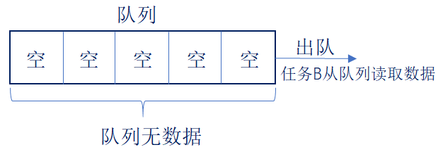

队列为空，此时读取不了数据：

1. 将该任务的状态列表挂载在pxDelayedTaskList；
2. 将该任务的事件列表项挂载在xTasksWaitingToReceive；


### 8、当多个任务写入消息给一个 “满队列” 时，这些任务都会进入阻塞状态，也就是说有多个任务在等待同一个队列的空间。那当队列有空间时，哪个任务会进入就绪态？

答：

1. 优先级最高的任务
2. 如果大家的优先级相同，那等待时间最久的任务进入就绪态。


### 9、队列创建、写入和读出过程

答：


------


## 二、队列结构体介绍

### 1、队列结构体

答：

```C
typedef struct QueueDefinition 
{
    int8_t * pcHead;                       /* 存储区域的起始地址 */
    int8_t * pcWriteTo;                    /* 下一个写入的位置 */
    union
    {
        QueuePointers_t     xQueue;
        SemaphoreData_t  xSemaphore; 
    } u ;
    List_t xTasksWaitingToSend;             /* 等待发送列表 */
    List_t xTasksWaitingToReceive;          /* 等待接收列表 */
    volatile UBaseType_t uxMessagesWaiting; /* 非空闲队列项目的数量 */
    UBaseType_t uxLength；                  /* 队列长度 */
    UBaseType_t uxItemSize;                 /* 队列项目的大小 */
    volatile int8_t cRxLock;                /* 读取上锁计数器 */
    volatile int8_t cTxLock;                /* 写入上锁计数器 */
   /* 其他的一些条件编译 */
} xQUEUE;
```

当用于队列使用时：

```C
typedef struct QueuePointers
{
    int8_t * pcTail;                 /* 存储区的结束地址 */
    int8_t * pcReadFrom;             /* 最后一个读取队列的地址 */
} QueuePointers_t;
```

当用于互斥信号量和递归互斥信号量时：

```c
typedef struct SemaphoreData
{
    TaskHandle_t xMutexHolder;		    /* 互斥信号量持有者 */
    UBaseType_t uxRecursiveCallCount;	/* 递归互斥信号量的获取计数器 */
} SemaphoreData_t;
```

队列结构体示意图：

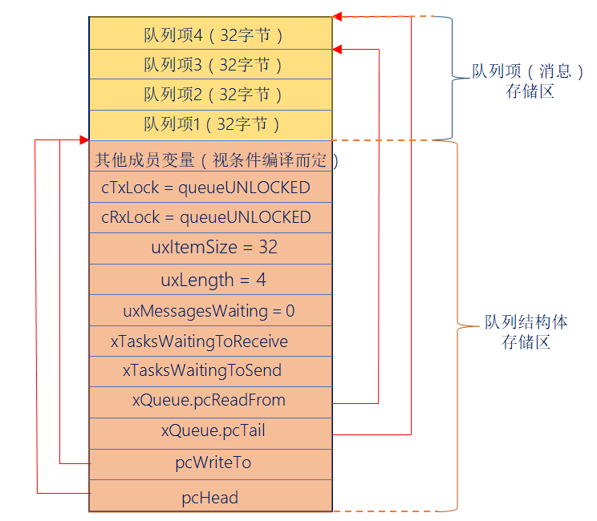

------


## 三、队列相关API函数介绍

### 1、队列使用流程

答：使用队列的主要流程：创建队列 —> 写队列 —> 读队列。


### 2、创建队列函数

答：

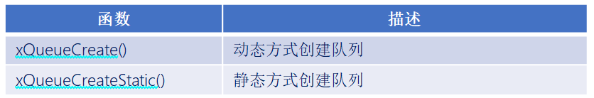

动态和静态创建队列之间的区别：队列所需的内存空间由 FreeRTOS 从 FreeRTOS 管理的堆中分配，而静态创建需要用户自行分配内存。

```C
#define xQueueCreate (  uxQueueLength,   uxItemSize  )
        xQueueGenericCreate( ( uxQueueLength ), ( uxItemSize ), (queueQUEUE_TYPE_BASE )) 
```

此函数用于使用动态方式创建队列，队列所需的内存空间由 FreeRTOS 从 FreeRTOS 管理的堆中分配。

函数参数：


函数返回值：

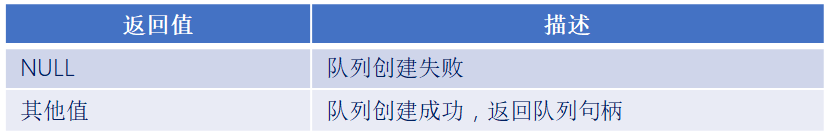


### 3、各种功能所对应的队列

答：

```c
#define queueQUEUE_TYPE_BASE                    ( ( uint8_t ) 0U )  /* 队列 */
#define queueQUEUE_TYPE_SET                     ( ( uint8_t ) 0U )  /* 队列集 */
#define queueQUEUE_TYPE_MUTEX                   ( ( uint8_t ) 1U )  /* 互斥信号量 */
#define queueQUEUE_TYPE_COUNTING_SEMAPHORE      ( ( uint8_t ) 2U )  /* 计数型信号量 */
#define queueQUEUE_TYPE_BINARY_SEMAPHORE        ( ( uint8_t ) 3U )  /* 二值信号量 */
#define queueQUEUE_TYPE_RECURSIVE_MUTEX         ( ( uint8_t ) 4U )  /* 递归互斥信号量 */
```


### 4、队列写入消息函数

答：

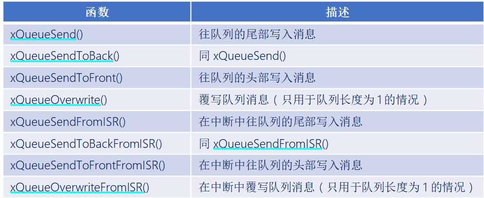

```c
#define  xQueueSend( xQueue, pvItemToQueue, xTicksToWait  )
         xQueueGenericSend( ( xQueue ), ( pvItemToQueue ), ( xTicksToWait ), queueSEND_TO_BACK )
```

```c
#define  xQueueSendToBack( xQueue, pvItemToQueue, xTicksToWait  )
         xQueueGenericSend( ( xQueue ), ( pvItemToQueue ), ( xTicksToWait ), queueSEND_TO_BACK )
```

```C
#define  xQueueSendToFront( xQueue, pvItemToQueue, xTicksToWait  )
         xQueueGenericSend( ( xQueue ), ( pvItemToQueue ), ( xTicksToWait ), queueSEND_TO_FRONT )
```

```C
#define  xQueueOverwrite(  xQueue,   pvItemToQueue  )
         xQueueGenericSend( ( xQueue ), ( pvItemToQueue ), 0, queueOVERWRITE )
```

可以看到这几个写入函数调用的是同一个函数xQueueGenericSend( )，只是指定了不同的写入位置！ 

队列一共有3种写入位置：

```c
#define queueSEND_TO_BACK                ( ( BaseType_t ) 0 )       /* 写入队列尾部 */
#define queueSEND_TO_FRONT              ( ( BaseType_t ) 1 )        /* 写入队列头部 */
#define queueOVERWRITE                  ( ( BaseType_t ) 2 )        /* 覆写队列*/
```

注意：覆写方式写入队列，只有在队列的队列长度为 1 时，才能够使用 。

往队列写入消息函数入口参数解析：

```C
BaseType_t      xQueueGenericSend(  QueueHandle_t       xQueue,
                                    const void * const  pvItemToQueue,
                                    TickType_t          xTicksToWait,
                                    const BaseType_t    xCopyPosition   );
```

函数参数：


函数返回值：

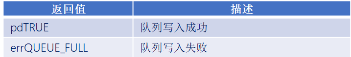


### 5、队列读出消息函数

答：

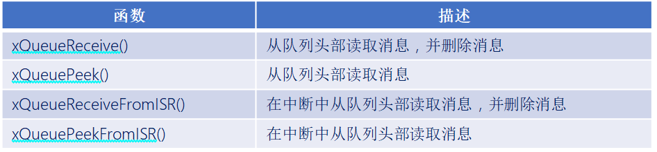

```c
BaseType_t    xQueueReceive( QueueHandle_t  xQueue, 
                             void *   const pvBuffer,  
                             TickType_t     xTicksToWait )
```

此函数用于在任务中，从队列中读取消息，并且消息读取成功后，会将消息从队列中移除。

函数参数：


函数返回值：

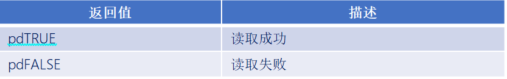


```C
BaseType_t   xQueuePeek( QueueHandle_t   xQueue,
                         void * const   pvBuffer,
                         TickType_t   xTicksToWait )
```

此函数用于在任务中，从队列中读取消息， 但与函数 xQueueReceive()不同，此函数在成功读取消息后，并不会移除已读取的消息！ 

函数参数：

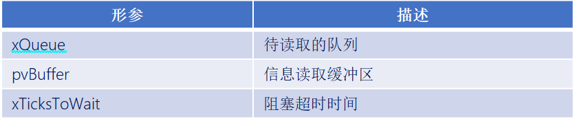

函数返回值：

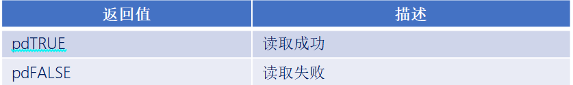

------

