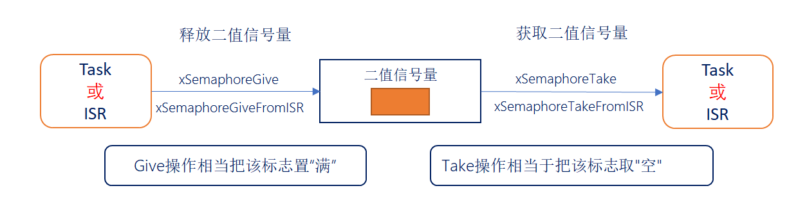
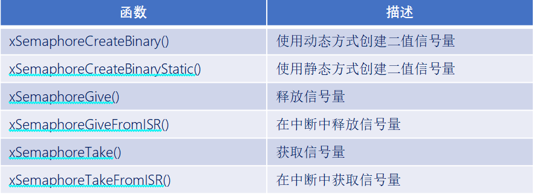
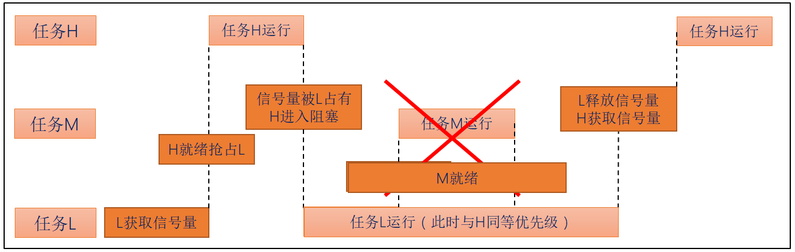

# FreeRTOS信号量

------


## 一、信号量简介

### 1、什么是信号量 

答：信号量是一种解决同步问题的机制，可以实现对共享资源的有序访问。

假设有一个人需要在停车场停车。


- 空车位：信号量资源数(计数值)
- 让出占用车位： 释放信号量(计数值++)
- 占用车位： 获取信号量(计数值--)

1. 首先判断停车场是否还有空车位(判断信号量是否有资源)。
2. 停车场正好有空车位(信号量有资源)，那么就可以直接将车开入停车位进行停车(获取信号量成功)。
3. 停车场已经没有空车位了(信号量没有资源)，那么可以选择不停车(获取信号量失败)，也可以选择等待(任务阻塞)其他人将车开出停车位(释放信号)，然后在将车停如空车位。


### 2、信号量简介

答：


- 当计数值大于0，表示有信号量资源。
- 当释放信号量，信号量计数值(资源数)加一。
- 当获取信号量，信号量计数值(资源数)减一。
- 信号量的计数值都是有限的：限定最大值。
- 如果最大值被限定为1，那么它就是二值信号量。
- 如果最大值不是1，它就是计数型信号量。

注意：信号量用于传递状态。


### 3、队列与信号量的对比

答：


------


## 二、二值信号量

### 1、二值信号量介绍

答：二值信号量的本质是一个队列长度为1的队列，该队列就只有空和满两种情况。这就是二值信号量。

注意：二值信号量通常用于互斥访问或任务同步，与互斥信号量比较类似，但是二值信号量有可能会导致优先级翻转的问题，所以二值信号量更适合用于同步！！！




### 2、二值信号量相关API函数

答：使用二值信号量的过程：创建二值信号量  ->  释放二值信号量  ->  获取二值信号量




### 3、创建二值信号量函数

答：创建二值信号量函数：

```c
SemaphoreHandle_t  xSemaphoreCreateBinary( void );
```

```c
#define   xSemaphoreCreateBinary()
xQueueGenericCreate(1 , semSEMAPHORE_QUEUE_ITEM_LENGTH, queueQUEUE_TYPE_BINARY_SEMAPHORE)
#define   semSEMAPHORE_QUEUE_ITEM_LENGTH   (( uint8_t ) 0U)
```

```c
#define   queueQUEUE_TYPE_BASE                           ( ( uint8_t ) 0U ) /* 队列 */
#define   queueQUEUE_TYPE_SET                            ( ( uint8_t ) 0U ) /* 队列集 */
#define   queueQUEUE_TYPE_MUTEX                          ( ( uint8_t ) 1U ) /* 互斥信号量 */
#define   queueQUEUE_TYPE_COUNTING_SEMAPHORE             ( ( uint8_t ) 2U ) /* 计数型信号量 */
#define   queueQUEUE_TYPE_BINARY_SEMAPHORE               ( ( uint8_t ) 3U ) /* 二值信号量 */
#define   queueQUEUE_TYPE_RECURSIVE_MUTEX                ( ( uint8_t ) 4U ) /* 递归互斥信号量 */
```

返回值：


### 4、释放二值信号量函数

答：释放二值信号量函数：

```c
BaseType_t   xSemaphoreGive( xSemaphore ) 
```

```c
#define   xSemaphoreGive ( xSemaphore )
xQueueGenericSend((QueueHandle_t)( xSemaphore ), NULL, semGIVE_BLOCK_TIME, queueSEND_TO_BACK)
#define   semGIVE_BLOCK_TIME       ( ( TickType_t ) 0U )
```

函数参数：


函数返回值：


### 5、获取二值信号量函数

答：获取二值信号量函数：

```c
BaseType_t   xSemaphoreTake( xSemaphore, xBlockTime ) 
```

函数参数：


函数返回值：


------


## 三、计数型信号量

### 1、计数型信号量介绍

答：计数型信号量相当于队列长度为1的队列，因此计数型信号量能够容纳多个资源，这在计数型信号量被创建的时候确定的。

计数型信号量适用场合：

- 事件计数 ： 当每次事件发生后，在事件处理函数中释放计数型信号量(计数值+1)，其他任务会获取计数型信号量(计数值-1)，这种场合一般在创建时将初始化计数值设置为0.
- 资源管理 ： 信号量表示有效资源数量。任务必须先获取信号量(信号计数值-1)才能获取资源控制权。当计数值减为0时表示没有资源。当任务使用完资源后，必须释放信号量(信号量计数值+1)。信号量创建时计数值应等于最大资源数目。


### 2、计数型信号量相关API函数

答：使用计数型信号量的过程：创建计数型信号量  ->  释放信号量  ->  获取信号量


注意：计数型信号量的释放与获取的函数和二值信号量一样。


### 3、计数型信号量创建函数

答：

```c
#define 	xSemaphoreCreateCounting( uxMaxCount , uxInitialCount )
            xQueueCreateCountingSemaphore( ( uxMaxCount ) , ( uxInitialCount ) ) 
```

函数参数：


函数返回值：


### 4、获取计数型信号量计数值函数

答：

```C
#define 	uxSemaphoreGetCount( xSemaphore ) 
            uxQueueMessagesWaiting(( QueueHandle_t )( xSemaphore ))
```

函数参数：


函数返回值：


------


## 四、优先级翻转介绍

### 1、优先级翻转简介

答：优先级翻转：高优先级的任务反而慢执行，低优先级的任务反而优先执行。

优先级翻转在抢占式内核中是非常常见的，但是在实时操作系统中是不允许出现优先级翻转的，因为优先级翻转会破坏任务的预期顺序，可能会导致未知的严重后果。

在使用二值信号量的时候，经常会遇到优先级翻转的问题。


### 2、优先级翻转的例子

答：


高优先级任务被低优先级任务阻塞，导致高优先级任务迟迟得不到调度。但其他中等优先级的任务却能抢到CPU资源。从现象上看，就像是中等优先级的任务比高优先级任务具有更高的优先权(即优先级翻转)。

------


## 五、互斥信号量

### 1、互斥信号量介绍

答：互斥信号量其实就是一个 拥有优先级翻转的二值信号量。

- 二值信号量更适用于同步的应用。
- 互斥信号量更适合那些需要互斥访问的应用(资源紧缺，需要资源保护)。


### 2、什么是优先级继承

答：当一个互斥信号量正在被一个低优先级的任务持有时，如果此时有一个高优先级的任务也尝试获取这个互斥信号量，那么这个高优先级的任务就会被阻塞。不过这个高优先级的任务会将低优先级任务的优先级提升到与自己相同的优先级。


### 3、优先级继承示例

答：



此时任务H的阻塞时间仅仅是任务L的执行时间，将优先级翻转的危害降低到了最低。


### 4、互斥信号量的注意事项

答：优先级继承并不能完全的消除优先级翻转的问题，它只是尽可能的降低优先级翻转带来的影响。

注意：互斥信号量不能用于中断服务函数中，原因如下：

1. 互斥信号量有优先级继承的机制，但是中断不是任务，没有任务优先级，所以互斥信号量只能用于任务中，不能用于中断服务函数中。
2. 中断服务函数中不能因为要等待互斥信号量而设置阻塞时间进入阻塞态。


### 5、互斥信号量相关API函数

答：使用互斥信号量：首先将宏configUSE_MUTEXES置1.

使用流程：创建互斥信号量  ->  (task)获取信号量  ->  (give)释放信号量

创建互斥信号量函数：


互斥信号量的释放和获取函数与二值信号量相同！！！只不过互斥信号量不支持中断中调用。

注意：创建互斥信号量时，会主动释放一次信号量。


### 6、创建互斥信号量函数

答：

```c
#define   xSemaphoreCreateMutex()      xQueueCreateMutex( queueQUEUE_TYPE_MUTEX )
```

函数返回值：


------

