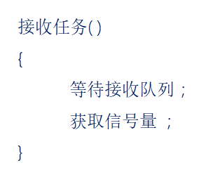
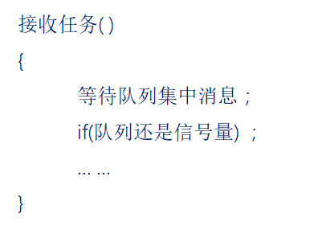
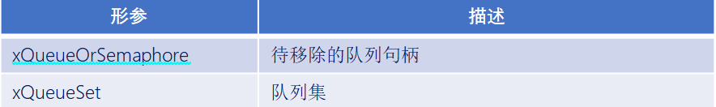

# FreeRTOS队列集

------


## 一、队列集简介

### 1、队列集介绍

答：

- 一个队列只允许任务间传递的消息为同一种数据类型，如果需要再任务间传递不同数据类型的消息时，那么就可以使用队列集！！！
- 作用：用于对多个队列或信号量进行“监听”，其中不管哪一个消息到来，都可让任务退出阻塞状态。

假设：有一个任务，使用到队列接收和信号量的获取，如下：

不使用队列集：



使用队列集：



------


## 二、队列集相关API函数

### 1、队列集相关API函数

答：


### 2、队列集创建函数

答：

```C
QueueSetHandle_t     xQueueCreateSet( const  UBaseType_t  uxEventQueueLength ); 
```

函数参数：


函数返回值：


### 3、队列集添加函数

答：

```C
BaseType_t xQueueAddToSet( QueueSetMemberHandle_t   xQueueOrSemaphore,
                           QueueSetHandle_t         xQueueSet); 
```

此函数用于往队列集中添加队列，要注意的时，队列在被添加到队列集之前队列中不能有有效的消息。

函数参数：


函数返回值：


### 4、队列集移除函数

答：

```C
BaseType_t   xQueueRemoveFromSet( QueueSetMemberHandle_t    xQueueOrSemaphore,
                                  QueueSetHandle_t          xQueueSet ); 
```

此函数用于从队列集中移除队列，要注意的是，队列在从队列集中移除之前，必须没有有效的消息。

函数参数：



函数返回值：


### 5、队列集获取函数

答：

```C
QueueSetMemberHandle_t   xQueueSelectFromSet( QueueSetHandle_t    xQueueSet,
                                              TickType_t const    xTicksToWait)
```

此函数用于在任务中获取队列集中有有效消息的队列。

函数参数：


函数返回值：


------

