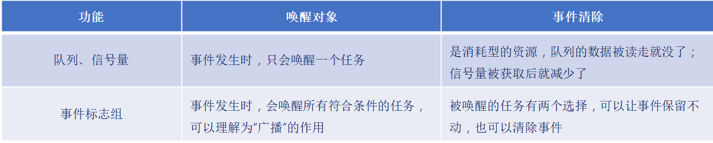
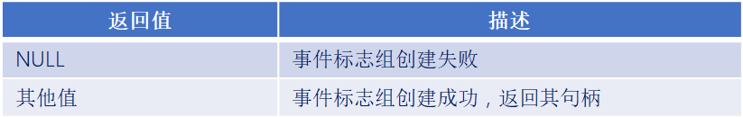
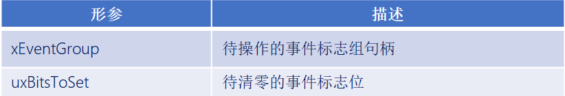
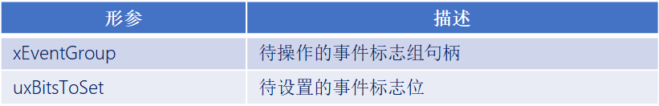
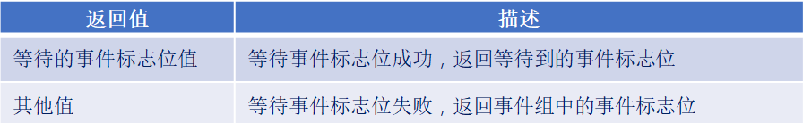

# FreeRTOS事件标志组

------


## 一、事件标志组简介

### 1、事件标志组介绍

答：

事件标志位：用一个位，来表示事件是否发生。

事件标志组是一组事件标志位的合集，可以简单的理解事件标志组，就是一个整数。


### 2、事件标志组的特点

答：

- 它的每一个位表示一个事件(高8位不算)。
- 每一位事件的含义，由用户自己决定，如：bit0表示按键是否按下，bit1表示是否接收到信息......
- 这些位的值为1表示事件发生了，值为0表示事件未发生。
- 任意任务或中断都可以读写这些位。
- 可以等待某一位成立，或者等待多位同时成立。


### 3、事件标志组的标志变量

答：一个事件组就包含了一个EventBits_t数据类型的变量，变量类型EventBits_t数据类型的定义如下所示：

```C
typedef TickType_t EventBits_t;
#if ( configUSE_16_BIT_TICKS  ==  1 )
	typedef   uint16_t   TickType_t;
#else
	typedef   uint32_t   TickType_t;
#endif

#define  configUSE_16_BIT_TICKS    0 
```

EventBits_t 实际上是一个 16 位或 32 位无符号的数据类型。

注意：虽然使用了32为/16位无符号的数据类型变量来存储事件标志，但其中的高8为作用是存储事件标志组的控制信息，低24位/8位的作用才是存储事件标志，所以说一个事件标志组最多可以存储24个事件标志！！！

24位事件标志组示例图：


### 4、事件标志组与队列、信号量的区别

答：



------


## 二、事件标志组相关API函数介绍

### 1、事件标志组相关API函数

答：


### 2、动态创建事件标志组函数

答：

```C
EventGroupHandle_t    xEventGroupCreate ( void ); 
```

函数返回值：




### 3、消除事件标志位函数

答：

```C
EventBits_t  xEventGroupClearBits( EventGroupHandle_t   xEventGroup,
                                   const EventBits_t    uxBitsToClear) 
```

函数参数：



函数返回值：


### 4、设置事件标志位函数

答：

```C
EventBits_t   xEventGroupSetBits(  EventGroupHandle_t   xEventGroup,
                                   const EventBits_t    uxBitsToSet ) 
```

函数参数：



函数返回值：


### 5、等待事件标志位函数

答：

```C
EventBits_t   xEventGroupWaitBits(   EventGroupHandle_t   xEventGroup,
                                     const EventBits_t    uxBitsToWaitFor,
                                     const BaseType_t     xClearOnExit,
                                     const BaseType_t     xWaitForAllBits,
                                     TickType_t           xTicksToWait  )
```

函数参数：


函数返回值：



函数特点：

1. 可以等待某一为、也可以等待多位。
2. 等待期望的事件后，可以选择自动清除相关位或者不清除。


### 6、同步事件标志组函数

答：

```C
EventBits_t     xEventGroupSync(   EventGroupHandle_t   xEventGroup,
                                   const EventBits_t    uxBitsToSet,
                                   const EventBits_t    uxBitsToWaitFor,
                                   TickType_t           xTicksToWait) 
```

函数参数：


函数返回值：


------

