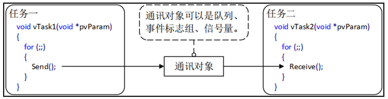
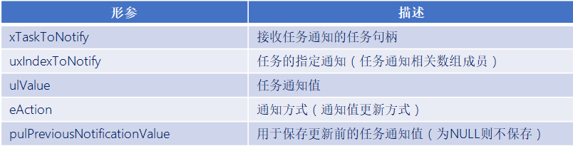
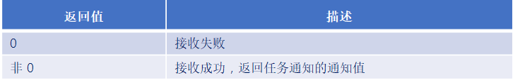

# FreeRTOS任务通知

------


## 一、任务通知的简介

### 1、任务通知介绍

答：任务通知：用来通知任务的，任务控制块中的结构体成员变量ulNotifiedValue就是这个通知值。

使用队列、信号量、事件标志组时都需要另外创建一个结构体，通过中间的结构体进行间接通信。



使用任务通知时，任务结构体TCB中就包含了内部对象，可以直接接收别人发过来的“通知”。


### 2、任务通知值的更新方式

答：

- 不覆盖接收任务的通知值。
- 覆盖接收任务的通知值。
- 更新接收任务通知值的一个或多个位。
- 增加接收任务的通知值。

只要合理，灵活的利用任务通知的特点，可以在一些场合中替代队列、信号量、事件标志组。


### 3、任务通知值的优势及劣势

答：

任务通知的优势：

- 效率更高：使用任务通知向任务发送事件或数据比使用队列、事件标志组或信号量快得多。
- 使用内存更小：使用其他方法时都要先创建对应的结构体，使用任务通知时无需额外创建结构体。

任务通知的劣势：

- 无法发送数据给ISR：ISR没有任务结构体，所以无法给ISR发送数据。但是ISR可以使用任务通知的功能，发数据给任务。
- 无法广播给多个任务：任务通知只能是被指定的一个任务接收并处理 。
- 无法缓存多个数据：任务通知是通过更新任务通知值来发送数据的，任务结构体中只有一个任务通知值，只能保持一个数据。
- 发送受阻不支持阻塞：发送方无法进入阻塞状态等待。

------


## 二、任务通知值和通知状态

### 1、任务通知结构体

答：

任务都有一个结构体---任务控制块，它里面有两个结构体成员变量：

```C
typedef  struct  tskTaskControlBlock 
{
      ......
      #if ( configUSE_TASK_NOTIFICATIONS  ==  1 )
           volatile  uint32_t    ulNotifiedValue [ configTASK_NOTIFICATION_ARRAY_ENTRIES ];
           volatile  uint8_t      ucNotifyState [ configTASK_NOTIFICATION_ARRAY_ENTRIES ];
      endif
      ......
} tskTCB;

#define  configTASK_NOTIFICATION_ARRAY_ENTRIES	1  	/* 定义任务通知数组的大小, 默认: 1 */
```

- 一个是uint32_t类型，用来表示任务通知值。
- 一个是uint16_t类型，用来表示任务通知状态。

 

### 2、任务通知值

答：

任务通知值的更新方式有多种类型：

1. 计数值(数值累加，类似信号量)。
2. 相应位置1(类似事件标志组)。
3. 任意数值(支持覆写或不覆写，类似队列)。


### 3、任务通知状态

答：任务通知状态共有3种。

```C
#define     taskNOT_WAITING_NOTIFICATION    ( ( uint8_t ) 0 )        /* 任务未等待通知 */
#define     taskWAITING_NOTIFICATION        ( ( uint8_t ) 1 )        /* 任务在等待通知 */
#define     taskNOTIFICATION_RECEIVED       ( ( uint8_t ) 2 )        /* 任务在等待接收 */
```

- 任务未等待通知：任务通知默认的初始化状态。
- 等待通知：接收方已经准备好了(调用了接收任务通知函数)，等待发送方给个通知。
- 等待接收：发送方已经发送过去(调用了发送任务通知函数)，等待接收方接收。

------


## 三、任务通知相关API函数

### 1、任务通知相关API函数介绍

答：任务通知API函数主要有两类：1-发送通知，2-接收通知。

注意：发送通知API函数可以用于任务和中断函数中，但接受通知API函数只能用在任务中。

发送通知相关API函数：


接收通知相关API函数：


### 2、发送任务通知函数

答：

所有发送任务通知函数：


```c
#define     xTaskNotifyAndQuery( xTaskToNotify,  ulValue,  eAction,  pulPreviousNotifyValue )
            xTaskGenericNotify( ( xTaskToNotify ), 
					          ( tskDEFAULT_INDEX_TO_NOTIFY ), 
					          ( ulValue ), 
					          ( eAction ),
					          ( pulPreviousNotifyValue ) )

#define     xTaskNotify  (xTaskToNotify ,  ulValue ,  eAction)
            xTaskGenericNotify(  ( xTaskToNotify ) ,  
                                 ( tskDEFAULT_INDEX_TO_NOTIFY ) ,  
                                 ( ulValue ) ,
                                 ( eAction ) , 
                                   NULL    )
 
#define     xTaskNotifyGive(  xTaskToNotify  )
            xTaskGenericNotify(  ( xTaskToNotify ) ,
                                 ( tskDEFAULT_INDEX_TO_NOTIFY ) ,
                                 ( 0 ) ,
                                 eIncrement ,
                                 NULL )
```

关键函数：

```c
BaseType_t     xTaskGenericNotify(  TaskHandle_t     xTaskToNotify,
                                    UBaseType_t      uxIndexToNotify,
                                    uint32_t         ulValue,
                                    eNotifyAction    eAction,
                                    uint32_t *       pulPreviousNotificationValue  )
```

发送任务通知的关键函数的参数：



任务通知方式枚举：

```c
typedef  enum
{    
     eNoAction = 0,              /* 无操作 */
     eSetBits                    /* 更新指定bit */
     eIncrement                  /* 通知值加一 */
     eSetValueWithOverwrite      /* 覆写的方式更新通知值 */
     eSetValueWithoutOverwrite   /* 不覆写通知值 */
} eNotifyAction;
```


### 3、接收任务通知函数

答：


注意：

- 当任务通知用于信号量时，使用函数 ulTaskNotifyTake() 获取获取信号量。
- 当任务通知用于事件标志组或队列时，使用函数 xTaskNotifyWait() 来获取。


ulTaskNotifyTake()函数：

```c
#define     ulTaskNotifyTake( xClearCountOnExit  ,   xTicksToWait )
            ulTaskGenericNotifyTake( ( tskDEFAULT_INDEX_TO_NOTIFY ),
                                     ( xClearCountOnExit ),
                                     ( xTicksToWait ) )
```

此函数用于接收任务通知值，可以设置在退出此函数的时候将任务通知值清零或者减一。

函数参数：


函数返回值：




xTaskNotifyWait()函数：

```C
#define     xTaskNotifyWait(    ulBitsToClearOnEntry,
                                ulBitsToClearOnExit,
                                pulNotificationValue,
                                xTicksToWait) 
            xTaskGenericNotifyWait(   tskDEFAULT_INDEX_TO_NOTIFY,
                                      ( ulBitsToClearOnEntry ),
                                      ( ulBitsToClearOnExit ),
                                      ( pulNotificationValue ),
                                      ( xTicksToWait )         ) 
```

```c
BaseType_t     xTaskGenericNotifyWait(     UBaseType_t     uxIndexToWaitOn,
                                           uint32_t        ulBitsToClearOnEntry,
                                           uint32_t        ulBitsToClearOnExit,
                                           uint32_t *      pulNotificationValue,
                                           TickType_t      xTicksToWait	    ); 
```

函数参数：


函数返回值：


------

