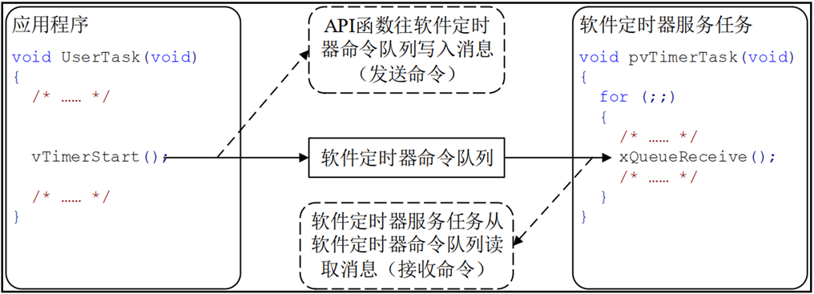
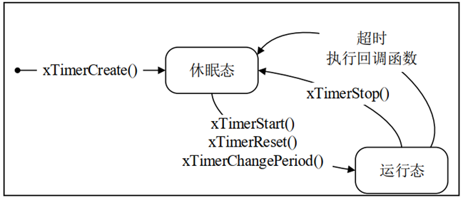
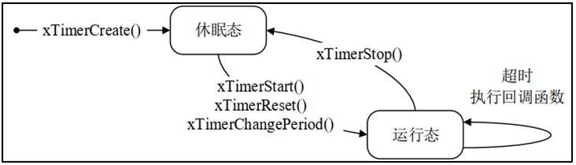
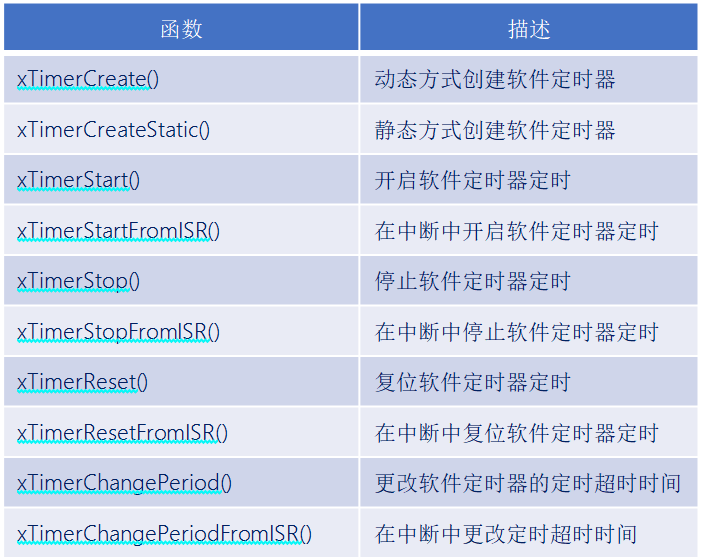
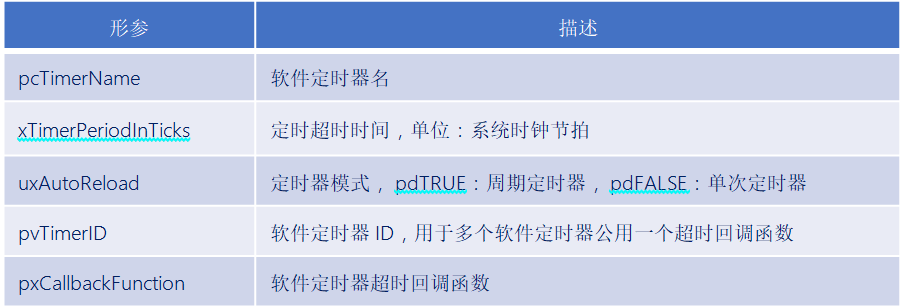
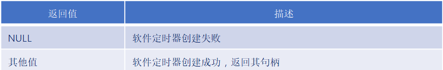
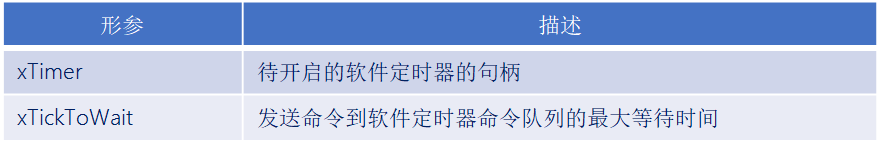
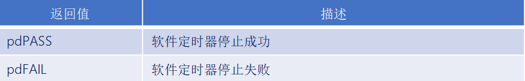

# FreeRTOS软件定时器

------


## 一、软件定时器的简介

### 1、定时器介绍

答：

定时器：从指定的时刻开始，经过一个指定时间，然后触发一个超时事件，用户可以自定义定时器周期。

硬件定时器：芯片本身自带的定时器模块，硬件定时器的精度一般很高，每次在定时时间到达之后就会自动触发一个中断，用户在中断服务函数中处理信息。

软件定时器：是指具有定时功能的软件，可设置定时周期，当指定时间到达后要调用回调函数(也称超时函数)，用户在回调函数中处理信息。


### 2、软件定时器优缺点

答：

优点：

- 硬件定时器数量有限，而软件定时器理论上只需有足够内存，就可以创建多个；
- 使用简单、成本低。

缺点：

- 软件定时器相对硬件定时器来说，精度没有那么高(因为它以系统时钟为基准，系统时钟中断优先级又是最低，容易被打断)。对于需要高精度要求的场合，不建议使用软件定时器。


### 3、FreeRTOS软件定时器特点

答：

1. 可裁剪：软件定时器是可裁剪可配置的功能，如果要使能软件定时器，需将configUSE_TIMERS 配置项配置成 1 。
2. 单次和周期：软件定时器支持设置成  **单次定时器**  或  **周期定时器**  。

注意：l软件定时器的超时回调函数是由软件定时器服务任务调用的，软件定时器的超时回调函数本身不是任务，因此不能在该回调函数中使用可能会导致任务阻塞的 API 函数。

软件定时器服务任务：在调用函数 vTaskStartScheduler()开启任务调度器的时候，会创建一个用于管理软件定时器的任务，这个任务就叫做**软件定时器服务任务**。


### 4、软件定时器服务任务作用

答：

1. 负责软件定时器超时的逻辑判断。
2. 调用超时软件定时器的超时回调函数。
3. 处理软件定时器命令队列。


### 5、软件定时器的命令队列

答：FreeRTOS 提供了许多软件定时器相关的 API 函数，这些 API 函数大多都是往定时器的队列中写入消息（发送命令），这个队列叫做软件定时器命令队列，是提供给 FreeRTOS 中的软件定时器使用的，用户是不能直接访问的。 




### 6、软件定时器的相关配置

答：

- l当FreeRTOS 的配置项 configUSE_TIMERS 设置为1，在启动任务调度器时，会自动创建软件定时器的服务/守护任务prvTimerTask( )。
- l软件定时器服务任务的优先级为 configTIMER_TASK_PRIORITY = 31。
- 定时器的命令队列长度为 configTIMER_QUEUE_LENGTH = 5。

注意：软件定时器的超时回调函数是在软件定时器服务任务中被调用的，服务任务不是专为某个定时器服务的，它还要处理其他定时器。

因此定时器的回调函数不要影响其他“人”：

1. 回调函数要尽快实行，不能进入阻塞状态，即不能调用那些会阻塞任务的 API 函数，如：vTaskDelay() 。
2. 访问队列或者信号量的非零阻塞时间的 API 函数也不能调用。

------


## 二、软件定时器的状态

### 1、软件定时器的状态

答：

- 休眠态：软件定时器可以通过其句柄被引用，但因为没有运行，所以其定时超时回调函数不会被执行。
- 运行态：运行态的定时器，当指定时间到达之后，它的超时回调函数会被调用。

注意：新创建的软件定时器处于休眠状态 ，也就是未运行的！ 


### 2、如何让软件定时器从休眠态转变为运行态？

答：发送命令队列。

------


## 三、单次定时器和周期定时器

### 1、单次定时器和周期定时器介绍

答：FreeRTOS提供了两种软件定时器：

- 单次定时器：单次定时器的一旦定时超时，只会执行一次其软件定时器超时回调函数，不会自动重新开启定时，不过可以被手动重新开启。
- 周期定时器：周期定时器的一旦启动以后就会在执行完回调函数以后自动的重新启动 ，从而周期地执行其软件定时器回调函数。


### 2、单次定时器和周期定时器的对比示例

答：


Timer1：周期定时器，定时超时时间为 2 个单位时间，开启后，一直以2个时间单位间隔重复执行。

Timer2：单次定时器，定时超时时间为 1 个单位时间，开启后，则在第一个超时后就不在执行了。


### 3、软件定时器的状态转换图

答：

单次定时器状态转换图：



周期定时器状态转换图：



------


## 四、软件定时器结构体成员介绍

### 1、软件定时器结构体介绍

答：

```c
typedef   struct
{
       const char *                  pcTimerName              /* 软件定时器名字 */
       ListItem_t                    xTimerListItem           /* 软件定时器列表项 */
       TickType_t                    xTimerPeriodInTicks;     /* 软件定时器的周期 */
       void *                        pvTimerID                /* 软件定时器的ID */
       TimerCallbackFunction_t       pxCallbackFunction;      /* 软件定时器的回调函数 */
       #if ( configUSE_TRACE_FACILITY == 1 )
              UBaseType_t 			uxTimerNumber            /*  软件定时器的编号，调试用  */
       #endif
       uint8_t                        ucStatus;               /*  软件定时器的状态  */
} xTIMER;

```

------


## 五、FreeRTOS软件定时器相关API函数

### 1、软件定时器相关函数

答：




### 2、创建软件定时器函数

答：

```c
TimerHandle_t   xTimerCreate(     const char * const        pcTimerName,
                                  const TickType_t          xTimerPeriodInTicks,
                                  const UBaseType_t         uxAutoReload,
                                  void * const              pvTimerID,
                                  TimerCallbackFunction_t   pxCallbackFunction  ); 
```

函数参数：



函数返回值：




### 3、开启软件定时器函数

答：

```C
BaseType_t     xTimerStart(   TimerHandle_t        xTimer,
                              const TickType_t     xTicksToWait  ); 
```

函数参数：



函数返回值：


### 4、停止软件定时器函数

答：

```C
BaseType_t     xTimerStop(   TimerHandle_t      xTimer,
                             const TickType_t 	xTicksToWait   ); 
```

函数参数：


函数返回值：




### 5、复位软件定时器函数

答：

```c
BaseType_t   xTimerReset( TimerHandle_t        xTimer,
                          const TickType_t     xTicksToWait); 
```

该函数将使软件定时器重新启动，复位后的软件定时器以复位是的时刻作为开启时刻重新定时。


函数参数：


函数返回值：


### 6、更改软件定时器超时时间函数

答：

```c
BaseType_t   xTimerChangePeriod( TimerHandle_t      xTimer,
                                 const TickType_t   xNewPeriod,
                                 const TickType_t   xTicksToWait );
```

函数参数：


函数返回值：


------

