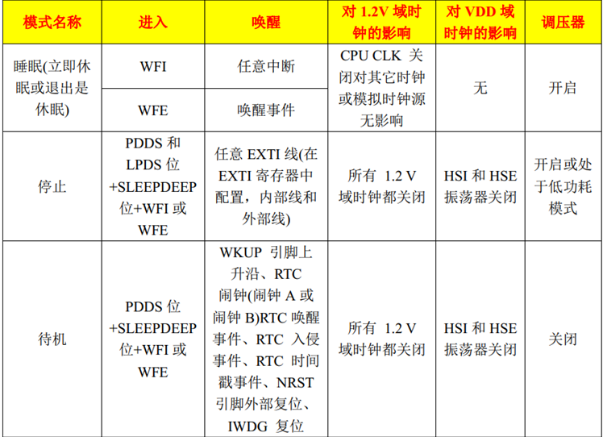

# Tickless低功耗模式

------

## 一、低功耗模式简介

### 1、低功耗介绍

答：很多应用场合对于功耗的要求很严格，比如可穿戴低功耗产品、物联网低功耗产品等；一般MCU都有相应的低功耗模式，裸机开发时可以使用MCU的低功耗模式。FreeRTOS也提供了一个叫Tickless的低功耗模式，方便带FreeRTOS操作系统的应用开发。

------

## 二、Tickless模式详解

### 1、STM32低功耗模式

答：STM32低功耗模式有3种，分别是：睡眠模式、停止模式、待机模式。

在FreeRTOS中主要使用的是睡眠模式：

- 进入睡眠模式：  WFI 指令(\__WFI )、WFE 指令(__WFE) 。
- 退出睡眠模式：任何中断或事件都可以唤醒睡眠模式。

### 2、Tickless模式如何降低功耗

答：Tickless低功耗模式的本质是通过调用指令 WFI 实现睡眠模式！

### 3、为什么要有Tickless模式

答：

任务运行时间统计实验中，可以看出，在整个系统的运行过程中，其实大部分时间是在执行空闲任务。

空闲任务：是在系统中的所有其他任务都阻塞或挂起时才运行的。

### 4、为了可以降低功耗，又不影响系统运行，该如何做？

答：可以在本该空闲任务执行的期间，让MCU 进入相应的低功耗模式；当其他任务准备运行的时候，唤醒MCU退出低功耗模式。

难点：

1. 进入低功耗之后，多久唤醒？也就是下一个要运行的任务如何被准确唤醒。
2. 任何中断均可唤醒MCU，若滴答定时器频繁中断则会影响低功耗的效果？

解决：将滴答定时器的中断周期修改为低功耗运行时间，退出低功耗后，需补上系统时钟节拍数。

值得庆幸的是：FreeRTOS 的低功耗 Tickless 模式机制已经处理好了这些难点。

------

## 三、Tickless模式相关配置项

### 1、Tickless模式配置

答：

- configUSE_TICKLESS_IDLE        

此宏用于使能低功耗 Tickless 模式 。

- configEXPECTED_IDLE_TIME_BEFORE_SLEEP     

 此宏用于定义系统进入相应低功耗模式的最短时长。

- configPRE_SLEEP_PROCESSING(x)

此宏用于定义需要在系统进入低功耗模式前执行的事务，如：进入低功耗前关闭外设时钟，以达到降低功耗的目的。

- configPOSR_SLEEP_PROCESSING(x)

此宏用于定义需要在系统退出低功耗模式后执行的事务，如：退出低功耗后开启之前关闭的外设时钟，以使系统能够正常运行。

### 2、需要系统运行低功耗模式需满足以下几个条件

答：

1. 在 FreeRTOSConfig.h 文件中配置宏定义 configUSE_TICKLESS_IDLE 为 1 。
2. 满足当前空闲任务正在运行，所有其他任务处在挂起状态或阻塞状态。
3. 当系统可运行于低功耗模式的时钟节拍数大于等于configEXPECTED_IDLE_TIME_BEFORE_SLEEP（该宏默认为2个系统时钟节拍)。

### 3、若想系统进入低功耗时功耗达到最低 

答：

1. 在进入睡眠模式前，可以关闭外设时钟、降低系统主频等，进一步降低系统功耗(调用函数configPRE_SLEEP_RPOCESSING()，需自行实现该函数的内部操作)。
2. 退出睡眠模式后，开启前面所关闭的外设时钟、恢复系统时钟主频等(退出睡眠模式后，开启前面所关闭的外设时钟、恢复系统时钟主频等)。

------

