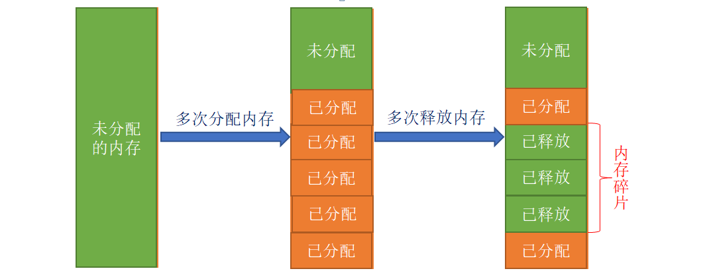
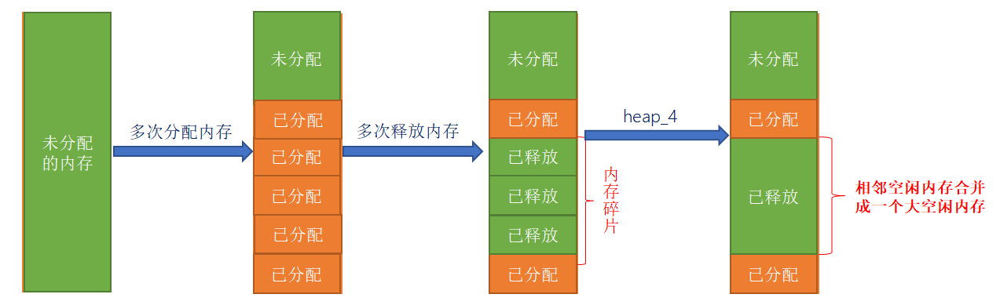

# FreeRTOS内存管理

------


## 一、FreeRTOS内存管理简介

### 1、FreeRTOS内存管理介绍

答：在使用 FreeRTOS 创建任务、队列、信号量等对象的时，一般都提供了两种方法：

- 动态方法创建：自动地从 FreeRTOS 管理的内存堆中申请创建对象所需的内存，并且在对象删除后，可将这块内存释放回FreeRTOS管理的内存堆 
- 静态方法创建：需用户提供各种内存空间，并且使用静态方式占用的内存空间一般固定下来了，即使任务、队列等被删除后，这些被占用的内存空间一般没有其他用途。

总结：**动态方式管理内存**相比与静态方式，更加灵活。


### 2、为什么不用标准的C库自带的内存管理算法

答：因为标准 C 库的动态内存管理方法有如下几个缺点：

- 占用大量的代码空间 不适合用在资源紧缺的嵌入式系统中。
- 没有线程安全的相关机制。
- 运行有不确定性，每次调用这些函数时花费的时间可能都不相同。
- 内存碎片化。

因此，FreeRTOS 提供了多种动态内存管理的算法，可针对不同的嵌入式系统！

------


## 二、FreeRTOS内存管理算法

### 1、FreeRTOS内存管理算法种类

答：FreeRTOS提供了5种动态内存管理算法，分别为： heap_1、heap_2、heap_3、heap_4、heap_5 。

如图所示：


在我们FreeRTOS例程中，使用的均为heap_4内存管理算法。


### 2、heap_1内存管理算法

答：

##### heap_1的特点：

heap_1只实现了pvPortMalloc，没有实现vPortFree；也就是说，它只能申请内存，无法释放内存！如果你的工程，创建好的任务、队列、信号量等都不需要被删除，那么可以使用heap_1内存管理算法。

heap_1的实现最为简单，管理的内存堆是一个数组，在申请内存的时候， heap_1 内存管理算法只是简单地从数组中分出合适大小的内存，内存堆数组的定义如下所示 ：

```c
/* 定义一个大数组作为 FreeRTOS 管理的内存堆 */
static uint8_t ucHeap[ configTOTAL_HEAP_SIZE ];
```

##### heap_1内存管理算法的分配过程如下图所示：


注意： heap_1内存管理算法，只能申请无法释放！


### 3、heap_2内存管理算法

答：

##### heap_2的特点：

- 相比于 heap_1 内存管理算法， heap_2 内存管理算法使用最适应算法，并且支持释放内存；
- heap_2 内存管理算法并不能将相邻的空闲内存块合并成一个大的空闲内存块；因此 heap_2 内存管理算法不可避免地会产生内存碎片；

##### 最适应算法：

假设heap有3块空闲内存（按内存块大小由小到大排序）：5字节、25字节、50字节。

现在新创建一个任务需要申请20字节的内存。

第一步：找出最小的、能满足pvPortMalloc的内存：25字节。

第二步：把它划分为20字节、5字节；返回这20字节的地址，剩下的5字节仍然是空闲状态，留给后续的pvPortMalloc使用。

##### heap_2内存管理算法的分配过程：

内存碎片是由于多次申请和释放内存，但释放的内存无法与相邻的空闲内存合并而产生的。



##### 适用场景：

频繁的创建和删除任务，且所创建的任务堆栈都相同，这类场景下Heap_2没有碎片化的问题。


### 4、heap_4内存管理算法

答：

##### heap_4的特点：

heap_4 内存管理算法使用了首次适应算法，也支持内存的申请与释放，并且能够将空闲且相邻的内存进行合并，从而减少内存碎片的现象。

##### 首次适应算法：

- 假设heap有3块空闲内存（按内存块地址由低到高排序）：5字节、50字节、25字节。
- 现在新创建一个任务需要申请20字节的内存。
- 第一步：找出第一个能满足pvPortMalloc的内存：50字节。
- 第二步：把它划分为20字节、30字节；返回这20字节的地址，剩下30字节仍然是空闲状态，留给后续的pvPortMalloc使用。

##### heap_4内存管理算法的分配过程：

heap_4内存管理算法会把相邻的空闲内存合并为一个更大的空闲内存，这有助于减少内存的碎片问题。



##### 适用于这种场景：

频繁地分配、释放不同大小的内存。


### 5、heap_5内存管理算法

答：

##### heap_5的特点：

heap_5 内存管理算法是在 heap_4 内存管理算法的基础上实现的，但是 heap_5 内存管理算法在 heap_4 内存管理算法的基础上实现了管理多个非连续内存区域的能力。

heap_5 内存管理算法默认并没有定义内存堆 ， 需要用户手动指定内存区域的信息，对其进行初始化。

##### 怎么指定一块内存？

使用如下结构体：

```c
typedef struct HeapRegion
{   
     uint8_t *     pucStartAddress;          /* 内存区域的起始地址 */
     size_t        xSizeInBytes;             /* 内存区域的大小，单位：字节 */
} HeapRegion_t; 
```

##### 怎么指定多块且不连续的内存？

```c
Const  HeapRegion_t  xHeapRegions[] = 
{
    {(uint8_t *)0x80000000, 0x10000 }, 	    /* 内存区域 1 */
    { (uint8_t *)0x90000000, 0xA0000 }, 	/* 内存区域 2 */
    { NULL, 0 }                             /* 数组终止标志 */
};
vPortDefineHeapRegions(xHeapRegions); 
```

##### 适用场景：

在嵌入式系统中，那些内存的地址并不连续的场景。

------


## 三、FreeRTOS内存管理相关API函数

### 1、FreeRTOS内存管理相关函数

答：


```C
void * pvPortMalloc( size_t xWantedSize );
```


```C
void vPortFree( void * pv );
```


```C
size_t xPortGetFreeHeapSize( void );
```


------

