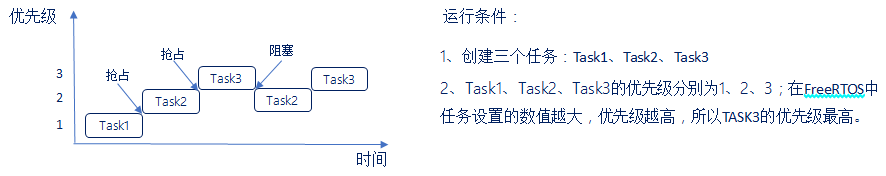
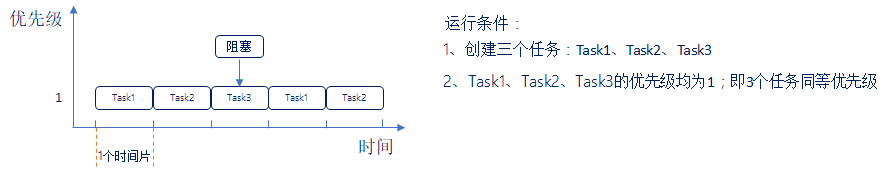

# FreeRTOS基础知识

## 一、任务调度简介(熟悉)

### 1、什么是任务调度器

答：任务调度器就是使用相关的调度算法来决定当前需要执行的哪个任务。

### 2、FreeRTOS的任务调度方式

答：FreeRTOS一共支持三种任务调度方式：

- 抢占式调度 ：主要是针对优先级不同的任务，每一个任务都有一个任务优先级，优先级高的任务可以抢占低优先级的任务的CPU使用权。
- 时间片调度 ：主要针对相同优先级的任务，当多个任务的优先级相同时，任务调度器会在每个时钟节拍到来的时候切换任务。
- 协程式调度 ：其实就是轮询，当前执行任务将会一直运行，同时高优先级的任务不会抢占低优先级任务。FreeRTOS现在虽然还在支持，但官方已经明确表示不再更新协程式调度。

### 3、抢占式调度过程

答：

运行过程如下：

1. 首先Task1在运行中，在这个过程中Task2就绪了，在抢占式调度器的作用下，Task2会抢占Task1的运行。
2. Task2运行过程中，Task3就绪了，在抢占式调度器的作用下Task3会抢占Task2的运行。
3. Task3运行过程中，Task3阻塞了(系统延时或者等待信号等)，此时就绪中，优先级最高的任务Task2执行。
4. Task3阻塞解除了(延时到了或者接收到信号量)，此时Task3恢复到就绪态中，抢占Task2的运行。

总结：

1. 高优先级任务，优先执行。
2. 高优先级任务不停止，低优先级任务无法执行。
3. 被抢占的任务将会进去就绪态。

### 4、什么是时间片

答：同等优先级任务轮流享有相同的CPU时间(可设置)，叫做时间片，在FreeRTOS中，一个时间片等于SysTick中断周期。

### 5、时间片调度过程

答：

运行过程如下：

1. 首先Task1运行完一个时间片后，切换至Task2运行。
2. Task2运行完一个时间片后，切换至Task3运行。
3. Task3运行过程中(还不到一个时间片)，Task3阻塞了(系统延时或者等待信号量等)，此时直接切换到下一个任务Task1执行。
4. Task1运行完一个时间片后，切换至Task2运行。

总结：

1. 同等优先级任务，轮流执行。
2. 一个时间片大小，取决滴答定时器中断周期。
3. 没有用完的时间片不会再使用，任务Task3下次得到执行时间还是按照一个时间片的时钟节拍运行。

------

## 二、任务状态( 熟悉)

### 1、FreeRTOS的任务状态

答：FreeRTOS中任务存在4种状态：

- 运行态 ：正在执行的任务，该任务就处于运行状态(注意：在STM32中，同一时间仅一个任务处于运行态)。
- 就绪态 ：如果该任务已经能够被执行，但当前还未被执行，那么该任务处于就绪态。
- 阻塞态 ：如果一个任务因为延时或者等待外部事件发生，那么这个任务就处于阻塞态。
- 挂起态 ：类似于暂停，调用函数vTaskSuspend()进入挂起态，需要调用解挂函数vTaskResume()才可以进入就绪态。

### 2、四种任务状态之间的转换关系

答：

总结：

1. 仅就绪态可以转换成运行态。
2. 其他状态的任务想要运行，必须先转换成就绪态。

### 3、任务状态列表

答：任务的四种状态中，除了运行态，其他三种任务状态的任务都有其对应的任务状态列表。

- 就绪列表 ： pxReadyTasksLists[x]，其中x代表人物优先级数值。
- 阻塞列表 ：pxDelayedTaskList
- 挂起列表 ：xSuspendedTaskList

------

